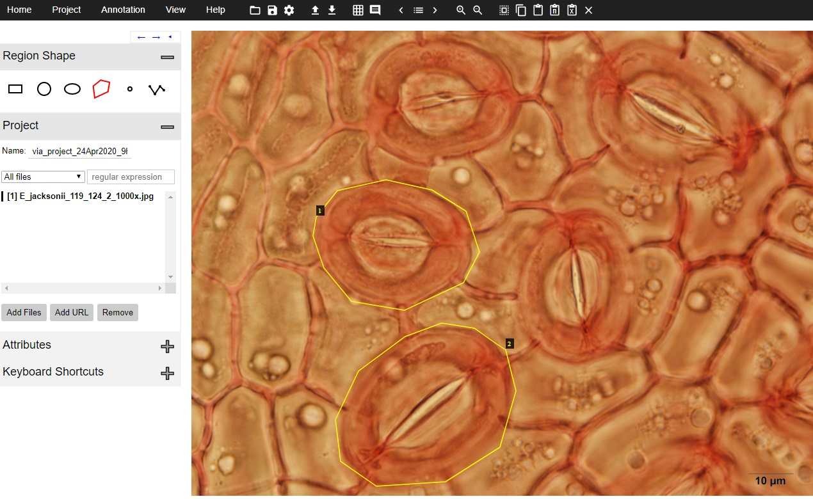

### MaskStomata: Generalised instance segmentation of stomata for Microscope Images

### Prerequisites:

Matterport implementation of Mask-RCNN: https://github.com/matterport/Mask_RCNN

Tensorflow >=1.5.1 (Tensorflow 1.5.1 recommended. April 2020)

Keras > 2.0.8 (Keras 2.1.5 recommended. April 2020)

# Getting Started:

Instructions are provided assuming a Google Colab environment. More advanced users can set-up the code in their own python environment
following the same instructions.

### 1. Using this repository for inference

Following folder structure is recommended for inference tasks.
```
.
|--inference_stomata.ipynb
|--mask_rcnn_stomata.h5
|--images
    |--test
        |--image01.jpg
        |--image02.jpg
        |--...jpg
    |--results
``` 
Instructions on ```inference_stomata.ipynb``` provide guidance on setting-up and running the code in Google Colab environment. The procedure is similar if the code is set-up in a local machine or a cloud computing instance.

The code will generate results for the images contained in the ```test``` folder, and will save the data in the ```results``` folder. All output images along with a ```results.csv``` file (which contains all metrics) will be saved in this folder.

### 2. Fine tuning the default model for a specific microscope dataset (Transfer Learning)

Recall values may be low for the default Stomata model when the input consists of low-quality images. In such cases, reseaarchers may opt to fine tune the Mask-RCNN model provided, using trasnfer learning techniques.

Following folder structure is recommended for transfer learning tasks.
```
.
|--transfer_learning_stomata.ipynb
|--mask_rcnn_stomata.h5
|--images
    |--train
        |--image01.jpg
        |--image02.jpg
        |--...
        |--via_region_data.json
    |--val
        |--image01.jpg
        |--image02.jpg
        |--...
        |--via_region_data.json
|--logs
```

#### 2.1 Preparing training data

The stomata detection model in the original publication converted all training data to a 3-channel grayscale colorspace to remove any biases due to to color. ```image_converter.ipynb``` can be used to achieve this goal for new training and validation data.

Follow the instructions on ```image_converter.ipynb```. The resulting training and validation images will be saved in ```images/train``` and ```images/val``` folders.

#### 2.2 Image labelling

VGG Image Annotator (VIA-2.0.8 or higher) is used for labelling training images. Download the browser based annotation tool [here](http://www.robots.ox.ac.uk/~vgg/software/via/).

1. Open VIA tool.
2. Go to **Project>Add local files** and add all images from the ```train``` folder.
3. Select **polygon region shape** from **Region Shape** section.
4. Mark stomata regions by left clicking along the stomata boundary. Press Enter to complete the loop.
5. To save the project, go to **Project>Save** and provide a project name.
6. To save the annotation values, go to **Annotation>Export Annotations(as json)** and save the file as ```va_region_data.json``` inside the train folder. Annotations Must be saved for training.
7. Follow steps 1-6 for validation dataset as well.



#### 2.3 Training Process

Instructions on ```transfer_learning_stomata.ipynb``` provide guidance on setting-up and running the code in Google Colab environment. The procedure is similar if the code is set-up in a local machine or a cloud computing instance. Training in Google Colab will take extensive time. Using a dedicated machine with GPU capability is recommended for this step.

Make sure all the folder paths are set-up correctly before executing the training process. Advanced users can modify additional parameters such as Anchor size for optimum performance.

The new model will be saved in ```logs``` directory. keep note of the ```MEAN_PIXEL``` value generated prior to training. This value is later needed for inference.

Inference with the new model can be done with ```inference_stomata.ipynb```. Make sure to modify ```MEAN_PIXEL``` value to match the value generated during training.


### 3. Publications

### 4. Citing this work


